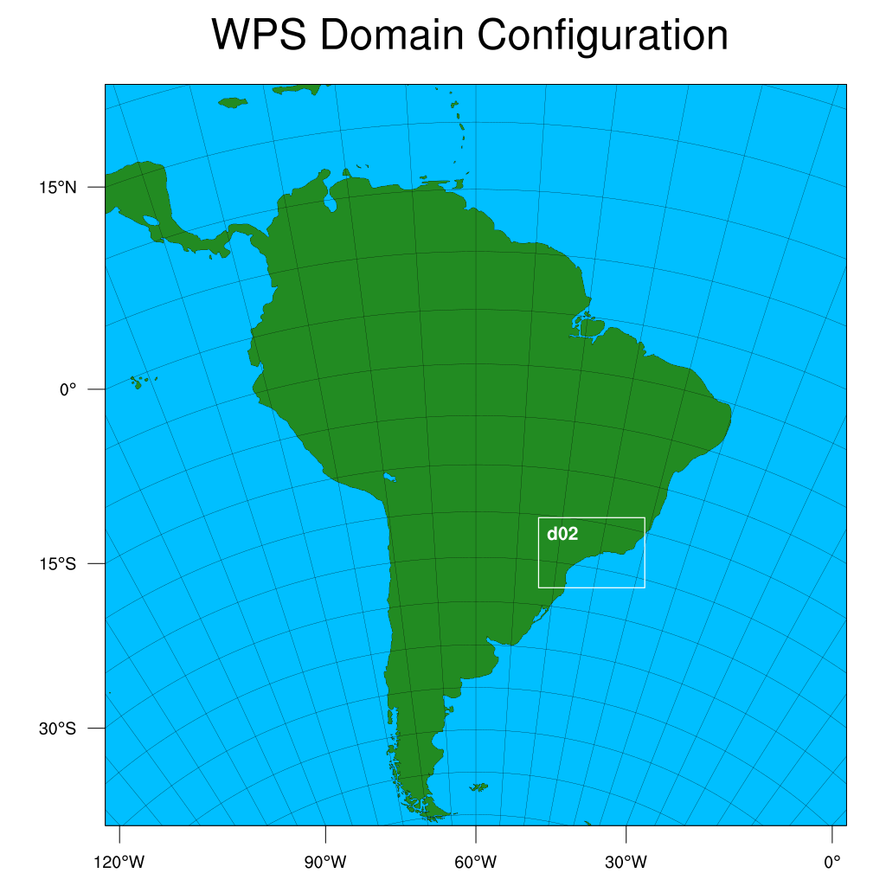

# Papila
Prediction of Air Pollution in Latin America and the Caribbean (PAPILA) is a research project focus to integer global and local emissions inventory of reactive gases, mainly for South America. The main motivation is to implement an air quality analysis and forecasting system using Eulerian models such as WRF-Chem and MUSICA to asses the air pollution impact on the human health. According to [Cartesana et al. (2022)](https://essd.copernicus.org/articles/14/271/2022/), the project started making an improved emissions inventory based on existing global data from CAMS-GLOB-ANT v4.1 and local inventory from countries as Argentina, Chile, and Colombia, including CO, NO$_x$, NMVOCs, NH$_3$, and SO$_2$ as anthropogenic annual emissions for the period 2014-2016, with a spatial resolution of 0.1° $\times$ 0.1° and 31-120° W and 34°N-58°S as modeling domain.

## Scope of work
- [ ] Model domain configuration,
  - [x] D01. 27 km x 27 km for all South American. 
    > Previous information: Papila suggests `450 x 455` grid points, 10 km x 10 km. However, we have reference of the model setup from [Vara-Vela et al. (2021)](https://journals.ametsoc.org/view/journals/bams/102/9/BAMS-D-21-0018.1.xml) which the model domain consists of `402`(WE) $\times$ `378`(SN) horizontal grid points at a resolution of 20 km and with 30 vertical layers. This work considers 350 x 350 grid points with 27 km of horizontal resolution.
  - [x] D02. `150` x `100` grid points with 9 km x 9 km horizontal resolution centering in the MASP. We have the reference of the model domain from [Gavidia-Calderon et al. (2018)](https://www.sciencedirect.com/science/article/pii/S1352231018306216?via%3Dihub).
- [ ] Prepare emissions inventory
  - [ ] Global anthropogenic emissions from CAMS
  - [ ] Biogenic emissions from MEGAN 3
  - [x] Biomass burning emissions from [FINN](https://www2.acom.ucar.edu/modeling/finn-fire-inventory-ncar)
- [ ] Simulate with WRF-Chem v 4.2.1
  - [ ] Meteorological IC/BC: [FNL GFS 0.25, ds.083.3](https://rda.ucar.edu/datasets/ds083.3/) for January, July, and September 2019. September is a interesting month when the biomass burning increase.
  - [ ] Chemical mechanism: MOZART/MOSAIC
  - [ ] Chemical IC/BC from CAM-Chem [output simulations](https://www.acom.ucar.edu/cam-chem/cam-chem.shtml)
 - [ ] Model evaluation
 


## Summary run
1. WPS: `./link_grib.csh $DATA/met/NCEP_GDAS/gdas1*`, `./geogrid.exe`, `./ungrib.exe`, `./metgrid.exe` 
2. WRF: `./real.exe` creates wrfinput and wrfbdy
3. Biogenic emissions (MEGAN 3): `./megan_bio_emiss < megan_bio_emiss.inp`
4. Anthropogenic emissions (CAMS): `./anthro_emis < anthro_emis.inp` creates `wrfchemi_<time>_<domain> 
5. Wes-coldens for mozart mechanism: `./wesely < wes_coldens.inp` and `./exo_coldens < wes_coldens.inp`
6. Biomass burning emissions from FINN: `./fire_emis < finn_mozart.inp`
7. Activate megan in `namelist.input`, locate the line with `io_form_auxinput6  = 2` and then run `./real.exe`
8. MOZBC using CAM-Chem as chemical initial and boundary conditions for wrfbdy_d01, wrfinput_d01, wrfinput_d02. It is necessary to link "met_em" files before to run MOZBC: `./mozbc < mozart_camchem.inp` which domain 01 is `do_bc = .true.` and `do_ic = .true.`, domain 02 is `do_bc = .false.` and `do_ic = .true.`.
9. Run WRF-Chem: `mpirun -np 64 -machinefile host_jano ./wrf.exe &`

## Adding variable into `wrfout`

To write a variable into the `wrfout`file, we need to modify the file **`registry.chem`** and then recompile WRF-Chem.
In this example, we'll modify the **`registry.chem`** to add  the photolysis rate.
More information (or at least, the guide we followed) is located [here](http://fengjm.ac.cn/climatemodels/wrf-registry.pdf).

1. The `registry.chem` is located in the `Registry` folder, which at the same time is located in your `WRF` folder.

```
.
├── arch
├── chem
├── clean
├── compile
├── configure
├── configure.wrf
├── configure.wrf.backup
├── doc
├── dyn_em
├── dyn_nmm
├── external
├── frame
├── hydro
├── inc
├── LICENSE.txt
├── main
├── Makefile
├── phys
├── README
├── README.md
├── Registry    <- Look here!
├── run
├── share
├── test
├── tools
├── var
└── wrftladj
```

2. By using your preferred editor, go to the variable you want to save. On this example let's try with **`PHOTR2`** (O31D Photolysis Rate) and **`PHOTR3`**  (O33P Photolysis Rate).
3. In the left column of the variable name, just add the **`h`** close to the **r**, so it results in **`rh`**. Sometimes, you'll fine that there is a **`-`**, replace it with **`rh`** to write it in the wrfout.

From this:
```
# photolysis rates
state    real  ph_o31d         ikj     misc        1         -      r        "PHOTR2"                "O31D Photolysis Rate" "min{-1}"
state    real  ph_o33p         ikj     misc        1         -      r        "PHOTR3"                "O33P Photolysis Rate" "min{-1}"
```
To this:
```
# photolysis rates
state    real  ph_o31d         ikj     misc        1         -      rh        "PHOTR2"                "O31D Photolysis Rate" "min{-1}"
state    real  ph_o33p         ikj     misc        1         -      rh        "PHOTR3"                "O33P Photolysis Rate" "min{-1}"
```
4. Finally, you need to recompile WRF-Chem and run the model.


## Git
- create .gitignore and exclude heavy data (input emissions, met, chemical IC/BC and WRF-Chem output)
- `git status` to see changes
- `git add -A` to add changes
- `git commit -am "Name of the change"` 
- If you save credential like user and access token, write `git config --global credential.helper store`, then write your username and access token, after they will save.
- `git push`
- If other person change something `git pull` to update changes.
